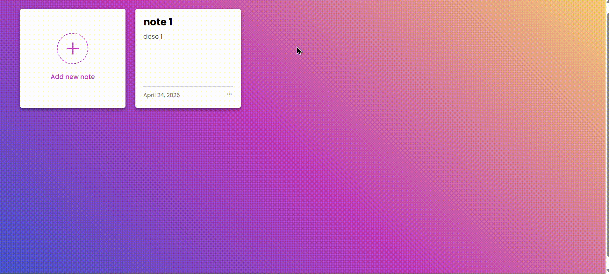

# Todo App

HTML, CSS ve JavaScript kullanılarak geliştirilmiş basit bir Todo uygulamasıdır.  
Uygulama CRUD (Create, Read, Update, Delete) işlemlerini destekler.

## 🚀 Özellikler

- Yeni görev ekleme
- Görevleri listeleme
- Görev güncelleme
- Görev silme
- LocalStorage ile veri saklama

## 📸 Uygulama Görünümü

## 🛠️ Kullanılan Teknolojiler

- HTML
- CSS
- JavaScript (Vanilla JS)

## 📌 Not

Bu proje öğrenme amaçlı geliştirilmiştir.
